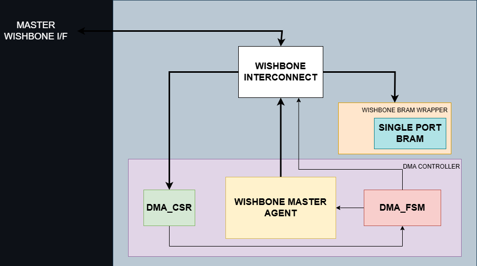

# Memory-to-Memory System with DMA and Multi-master Wishbone Interconnect

## Table of Contents
* [Introduction](#intro)
* [Run tests](#test)
* [Architecture](#Architecture)
* [CSRs](#csrs)

## <a name="intro"></a> Introduction

A simple System-on-Chip (SoC) featuring a Memory-to-Memory (M2M) DMA controller within a multi-master Wishbone bus fabric with following features:
- System-Level CPU Access: The host CPU (simulated by the testbench) acts as the primary bus master, with the ability to perform read/write transactions directly to both the main memory (BRAM) and the DMA's Control/Status Registers via the central interconnect.
- DMA `Slave` Interface: The DMA IP provides a Wishbone `Slave` interface to allow the CPU to program its CSRs.
- DMA `Master` Interface: The DMA IP provides a Wishbone `Master` interface to autonomously fetch data from a source address and write it to a destination address in memory.
- Multi-Master Support: The system includes a central interconnect with a fixed-priority arbiter, ensuring the CPU is favorable than the DMA.
- Automated Register Generation: The entire CSR block is generated from a simple YAML specification using [Rggen](https://github.com/rggen/rggen) tool.
- Interrupt Capability: An interrupt can be generated upon completion of a transfer, allowing for efficient, event-driven software interaction.

## <a name="test"></a> Run tests

This repository contains various tests for submodules and the system (UVM Test for this project will be updated in the future). To run all the tests and generate the waveforms, run the command:
```bash
make run_no_uvm TEST_MODULE=<module_test>
```

This is the details of testbenches developed:

| **No** |     **Test name**    |                  **Quick description**                 | 
|:------:|:--------------------:|:------------------------------------------------------:|
|    1   |    dma_csr_tb_top    |        Run some simple write/read in the RW CSRs       |
|    2   |    dma_fsm_tb_top    |          Verify the DMA's core state machine and the interrupt signal           |
|    3   | wishbone_master_agent_tb_top  |  Run some simple write/read from the DMA to the memory     |
|    4   |    dma_system_tb_top    |     Two test scenarios with `LENGTH` of transfer varies         |

In the `dma_system_tb_top`, both test scenarios check the parallel transactions driven by both the CPU and the DMA. After the CSRs register written done by the CPU, the DMA starts to do its job:
- In the first scenario, while the DMA is doing its job, the CPU continuously checks the status of the DMA (through CSRs ``busy`` bit - see [CSRs](#csrs)), as well as sending its own `READ` transaction to read from the memory.
- In the second scenario, the CPU enable the interrupt mode and continuously sends a `READ` transaction until the interrupt is asserted by the DMA.

## <a name="Architecture"></a> Architecture


